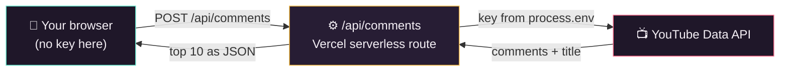

<div align="center">


# Comment Deck

**Pull the top 10 comments from any YouTube video and flip through them like a deck of cards.**

Made for reading fan comments aloud on camera — big, readable type, one comment at a time,
keyboard paging, and a one-click "copy all" for your teleprompter.
Your YouTube API key lives on the server and **never reaches the browser**.

[](https://vercel.com/new/clone?repository-url=https%3A%2F%2Fgithub.com%2Fjpetree331%2Fyoutube-comment-puller&env=YOUTUBE_API_KEY&envDescription=YouTube%20Data%20API%20v3%20key%20(kept%20server-side)&envLink=https%3A%2F%2Fconsole.cloud.google.com%2Fapis%2Flibrary%2Fyoutube.googleapis.com&project-name=comment-deck&repository-name=comment-deck)


</div>

---

## ✨ Features

- **Top 10 by likes** — pulls up to ~300 comments in YouTube's "relevance" order, re-ranks them by like count, and keeps the ten best.
- **Card-deck reader** — one comment per card with a `#N of 10` badge, avatar, like count, and timestamp. Big, on-camera-friendly type.
- **Flip fast** — on-screen arrows, **← / → keyboard paging**, and clickable dots.
- **Copy all 10** — dumps a clean numbered, plain-text list for a teleprompter or show notes.
- **Recent** — every pull is cached in your browser, so past videos reopen instantly (even offline).
- **Your key stays secret** — the browser only ever calls *your* API route; the key never ships to the client.
- **Optional passcode** — gate a public deployment so strangers can't burn your YouTube quota.

## 🚀 Deploy your own

The fastest path — one click, then paste your key:

1. Click **[Deploy with Vercel](https://vercel.com/new/clone?repository-url=https%3A%2F%2Fgithub.com%2Fjpetree331%2Fyoutube-comment-puller&env=YOUTUBE_API_KEY&envDescription=YouTube%20Data%20API%20v3%20key%20(kept%20server-side)&envLink=https%3A%2F%2Fconsole.cloud.google.com%2Fapis%2Flibrary%2Fyoutube.googleapis.com&project-name=comment-deck&repository-name=comment-deck)** above.
2. Vercel clones the repo and asks for `YOUTUBE_API_KEY` — paste the key from the next section.
3. Deploy. That's it.

> Want a lock on it? After deploying, add an `APP_PASSCODE` environment variable in
> **Project → Settings → Environment Variables**. The app will then ask for that passcode once
> and remember it on your device.

## 🔑 Get a YouTube Data API key

The tool needs a free **YouTube Data API v3** key (Google's quota is 10,000 units/day — plenty; each pull costs only a few units).

1. Open the [Google Cloud Console](https://console.cloud.google.com/) and create or pick a project.
2. **APIs & Services → Library →** search **YouTube Data API v3 →** **Enable**.
3. **APIs & Services → Credentials → Create credentials → API key**.
4. **Restrict the key** (recommended): edit it → **API restrictions → Restrict key → YouTube Data API v3**.
   This limits the damage if the key ever leaks.

## 🖥️ Run it locally

```bash
git clone https://github.com/jpetree331/youtube-comment-puller.git
cd youtube-comment-puller
npm install

# add your key:
cp .env.example .env.local
# then edit .env.local and set YOUTUBE_API_KEY=AIza...

npm run dev
```

Open <http://localhost:3000>, paste a video URL, and pull.

| Variable          | Required | Purpose                                                            |
| ----------------- | -------- | ----------------------------------------------------------------- |
| `YOUTUBE_API_KEY` | **Yes**  | YouTube Data API v3 key. **Server-only** — never prefix `NEXT_PUBLIC_`. |
| `APP_PASSCODE`    | No       | If set, the API requires this passcode. Leave unset to disable.   |

## 🔒 How your key stays private

The whole point of this port: the browser never talks to Google directly. It calls **your** serverless
route, and only that route — running on Vercel with the key in an environment variable — talks to YouTube.



The key appears **nowhere** in the client bundle or page source — no `googleapis.com` request ever
leaves your browser. (Verify it yourself: open DevTools → Network while pulling a video; the only
comment call is `POST /api/comments`.)

## ⌨️ Interactions

| Action              | How                                             |
| ------------------- | ----------------------------------------------- |
| Next / previous     | Arrow buttons, or **← / →** keys                |
| Jump to a comment   | Click a dot                                     |
| Copy all 10 as text | **Copy all 10** button (numbered plain-text)    |
| Reopen a past pull  | **Recent** dropdown                             |
| Settings / passcode | Gear icon (top-right)                           |

## 🧠 How ranking works

YouTube's API can't sort comments by likes directly, so the tool fetches up to **3 pages of 100**
comments in *relevance* order, then re-sorts everything it collected by like count and keeps the
**top 10**. Popular videos have their most-liked comments surface in relevance order anyway, so this
window reliably catches the crowd favorites.

## 🛠️ Tech & structure

Next.js 15 (App Router) · TypeScript · React 19 · deployed on Vercel. No database — recent pulls live in your browser's `localStorage`.

```
app/
  api/comments/route.ts   # the security boundary: the only caller of googleapis.com
  api/config/route.ts     # reports only whether a passcode is required
  components/             # CommentCard + inline SVG icons
  globals.css             # the visual design
  page.tsx                # the deck UI and all interactions
lib/
  youtube.ts              # video-ID parsing, fetch/sort/slice, error mapping (server)
  storage.ts              # localStorage deck cache + passcode (client)
  format.ts               # relative timestamps
comment-deck.html         # the original single-file version this was ported from
```

## 📄 License

[MIT](LICENSE) — free to use, fork, and modify. Built by [@jpetree331](https://github.com/jpetree331).
