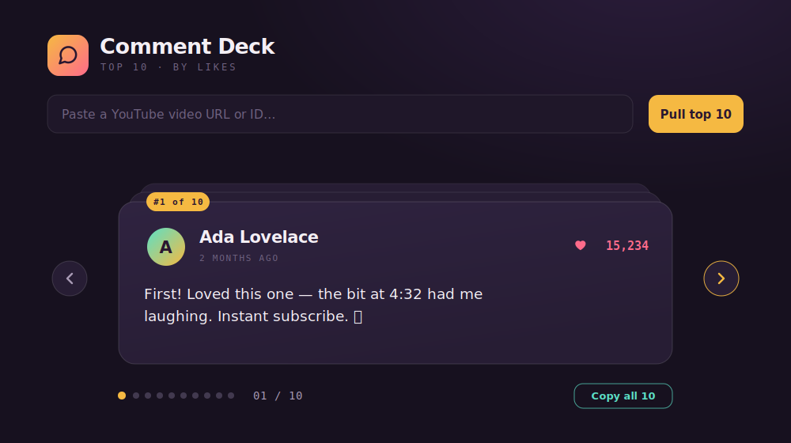
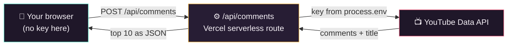

<div align="center">



# Comment Deck

**Pull the top comments from any YouTube video and flip through them like a deck of cards.**

Made for reading fan comments aloud on camera — big, zoomable type, one comment at a time,
a distraction-free focus mode, keyboard paging, and a one-click "copy all" for your teleprompter.
Pull the **most-liked**, **YouTube's own order**, or a **random** handful — 10, 25, 50, or 100 at a time.
Your YouTube API key lives on the server and **never reaches the browser**.

[](https://vercel.com/new/clone?repository-url=https%3A%2F%2Fgithub.com%2Fjpetree331%2Fyoutube-comment-puller&env=YOUTUBE_API_KEY&envDescription=YouTube%20Data%20API%20v3%20key%20(kept%20server-side)&envLink=https%3A%2F%2Fconsole.cloud.google.com%2Fapis%2Flibrary%2Fyoutube.googleapis.com&project-name=comment-deck&repository-name=comment-deck)


</div>

---

## ✨ Features

- **Three ways to pull** — **Most liked** (re-ranked by like count), **YouTube top** (the site's own relevance order), or **Random** (a shuffled sample).
- **Choose how many** — 10, 25, 50, or 100 comments per pull, plus the video's total comment count.
- **Card-deck reader** — one comment per card with a `#N of M` badge, avatar, like count, and timestamp. Big, on-camera-friendly type.
- **Zoom & focus mode** — scale the comment text with `+` / `−`, or pop into a full-window focus view to read big on camera.
- **Flip fast** — on-screen arrows, **← / → keyboard paging**, clickable dots (or a jump box for large pulls).
- **Copy all** — dumps a clean numbered, plain-text list for a teleprompter or show notes.
- **Recent** — every pull is cached in your browser, so past videos reopen instantly (even offline).
- **Your key stays secret** — the browser only ever calls *your* API route; the key never ships to the client.
- **Optional passcode** — gate a public deployment so strangers can't burn your YouTube quota.

## 🚀 Deploy your own

The fastest path — one click, then paste your key:

1. Click **[Deploy with Vercel](https://vercel.com/new/clone?repository-url=https%3A%2F%2Fgithub.com%2Fjpetree331%2Fyoutube-comment-puller&env=YOUTUBE_API_KEY&envDescription=YouTube%20Data%20API%20v3%20key%20(kept%20server-side)&envLink=https%3A%2F%2Fconsole.cloud.google.com%2Fapis%2Flibrary%2Fyoutube.googleapis.com&project-name=comment-deck&repository-name=comment-deck)** above.
2. Vercel clones the repo and asks for `YOUTUBE_API_KEY` — paste the key from the next section.
3. Deploy. That's it.

> Want a lock on it? After deploying, add an `APP_PASSCODE` environment variable in
> **Project → Settings → Environment Variables**. The app will then ask for that passcode once
> and remember it on your device.

## 🔑 Get a YouTube Data API key

The tool needs a free **YouTube Data API v3** key (Google's quota is 10,000 units/day — plenty; each pull costs only a few units).

1. Open the [Google Cloud Console](https://console.cloud.google.com/) and create or pick a project.
2. **APIs & Services → Library →** search **YouTube Data API v3 →** **Enable**.
3. **APIs & Services → Credentials → Create credentials → API key**.
4. **Restrict the key** (recommended): edit it → **API restrictions → Restrict key → YouTube Data API v3**.
   This limits the damage if the key ever leaks.

## 🖥️ Run it locally

```bash
git clone https://github.com/jpetree331/youtube-comment-puller.git
cd youtube-comment-puller
npm install

# add your key:
cp .env.example .env.local
# then edit .env.local and set YOUTUBE_API_KEY=AIza...

npm run dev
```

Open <http://localhost:3000>, paste a video URL, and pull.

| Variable          | Required | Purpose                                                            |
| ----------------- | -------- | ----------------------------------------------------------------- |
| `YOUTUBE_API_KEY` | **Yes**  | YouTube Data API v3 key. **Server-only** — never prefix `NEXT_PUBLIC_`. |
| `APP_PASSCODE`    | No       | If set, the API requires this passcode. Leave unset to disable.   |

## 🔒 How your key stays private

The whole point of this port: the browser never talks to Google directly. It calls **your** serverless
route, and only that route — running on Vercel with the key in an environment variable — talks to YouTube.



The key appears **nowhere** in the client bundle or page source — no `googleapis.com` request ever
leaves your browser. (Verify it yourself: open DevTools → Network while pulling a video; the only
comment call is `POST /api/comments`.)

## ⌨️ Interactions

| Action              | How                                                      |
| ------------------- | -------------------------------------------------------- |
| Pick a mode & count | **Most liked / YouTube top / Random** toggle + count picker |
| Next / previous     | Arrow buttons, or **← / →** keys                         |
| Jump to a comment   | Click a dot, or type a number in the jump box            |
| Bigger / smaller    | **+ / −** buttons or keys (zoom the comment text)        |
| Focus (big read)    | **Focus** button — fills the window; **Esc** to exit     |
| Copy all as text    | **Copy all** button (numbered plain-text)                |
| Reopen a past pull  | **Recent** dropdown                                      |
| Settings / passcode | Gear icon (top-right)                                    |

## 🧠 The three pull modes

YouTube's default **"Top comments"** order is a *relevance/engagement* ranking (likes, replies,
recency, and other signals) — **not** a strict most-liked sort. Comment Deck fetches up to **3 pages
of 100** comments in that relevance order, then gives you three ways to read them:

- **Most liked** — re-sorts the pool by like count, so you get the genuinely most-hearted comments
  (a truer "top" than YouTube's own list).
- **YouTube top** — keeps YouTube's relevance order untouched — exactly what visitors see on the site.
- **Random** — shuffles the pool for a fresh, unbiased handful each pull.

Each mode returns as many as you pick (10–100). For popular videos, the crowd favorites surface
within that relevance window regardless of mode.

## 🛠️ Tech & structure

Next.js 15 (App Router) · TypeScript · React 19 · deployed on Vercel. No database — recent pulls live in your browser's `localStorage`.

```
app/
  api/comments/route.ts   # the security boundary: the only caller of googleapis.com
  api/config/route.ts     # reports only whether a passcode is required
  components/             # CommentCard, DeckStage, inline SVG icons
  globals.css             # the visual design
  page.tsx                # the deck UI, pull modes, zoom, and focus mode
lib/
  youtube.ts              # video-ID parsing, fetch + rank/shuffle by mode, error mapping (server)
  storage.ts              # localStorage deck cache, passcode, zoom (client)
  format.ts               # relative timestamps
comment-deck.html         # the original single-file version this was ported from
```

## 📄 License

[MIT](LICENSE) — free to use, fork, and modify. Built by [@jpetree331](https://github.com/jpetree331).
